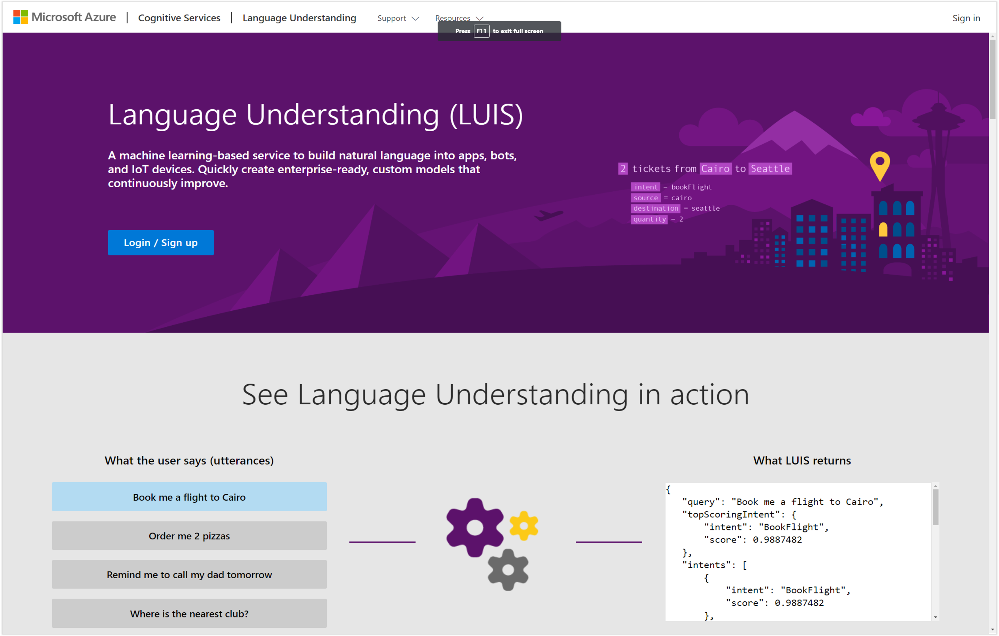

# Logging into LUIS
We will start off by logging into the LUIS.

To do this, all you need to do is navigate to the LUIS website by going to http://www.luis.ai and then click on the Login / Sign up link on the page.

This will allow you to authenticate with LUIS using your AD account.
And that will take you into the My Apps page within LUIS where you will be able to manage all of the different applications that you have trained within the Language Understanding system.

