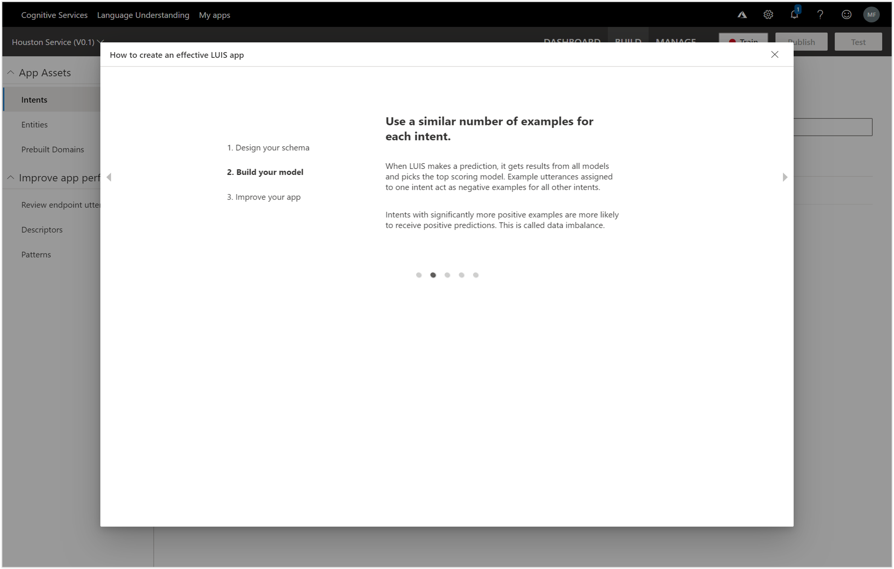
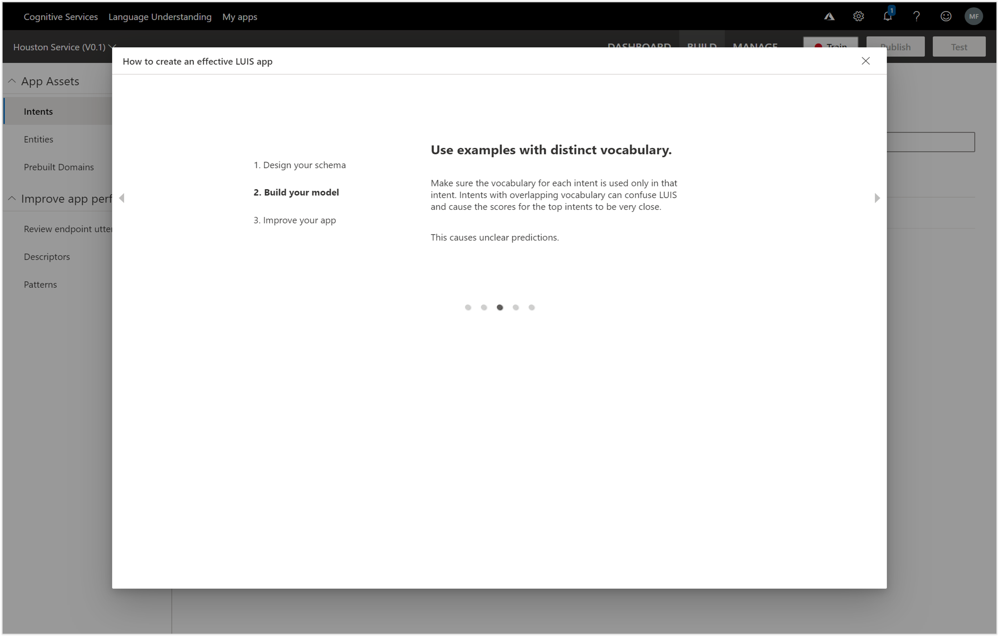

# Creating a LUIS Application
Now that we are logged into LUIS, we can create a Language Understanding App that we will be able to train on all of the different ways that we can ask questions to our bot.

Start off by clicking on the + Create new app link within the My Apps page.

This will open up the Create new app form where we will be able to set up the details for our LUIS app.

Start off by giving the app a Name.  Here we set the Name to Supply Chain Service.

And if you want, you can give your app a more detailed Description.  Here we set the Description to Supply Chain Language Domain Service.
After you have done that just click on the Done button to create the new LUIS app.

This will take us into the Intents page which will allow us to create groupings of intents (or general objectives) that we will be able to classify out commands though.

