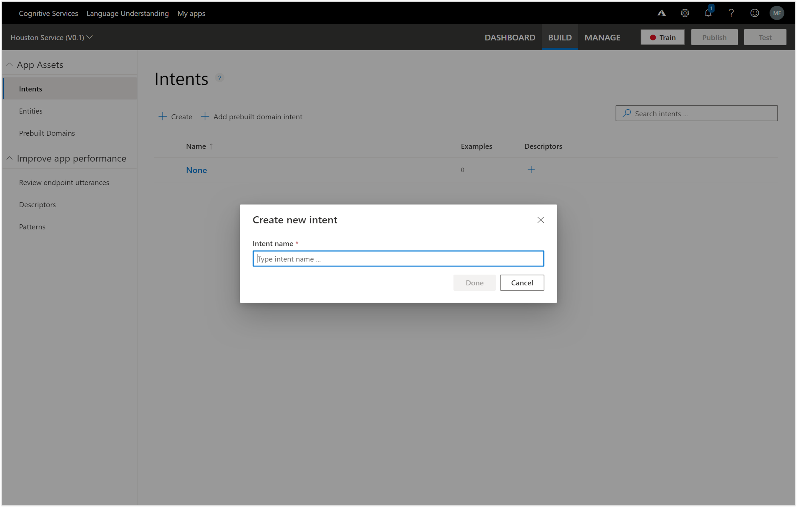
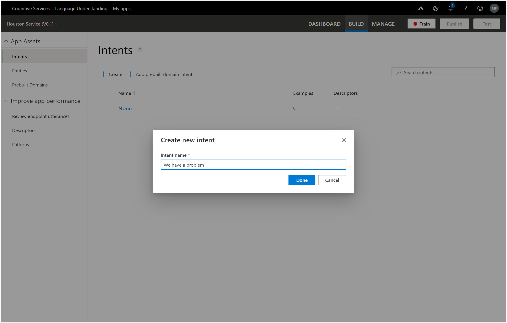

# Creating a LUIS Intent
Now that we have the app we can start building the different types of questions or intents that LUIS will be able to use to classify statements with.

All we need to do here is click on the + Create new intent link in the header of the Intents page.

This will open up a Create new intent dialog box.

We just need to give the Intent and Intent name and then click on the Done button.  For this example we set the Intent name to Product Inquiry because all of the sentences that we use to train LUIS will be related to inquiring about a product and also the availability of the product.

This will take us into the Intents page within LUIS that we will use to describe all of the different ways that we are able to ask the same question.

