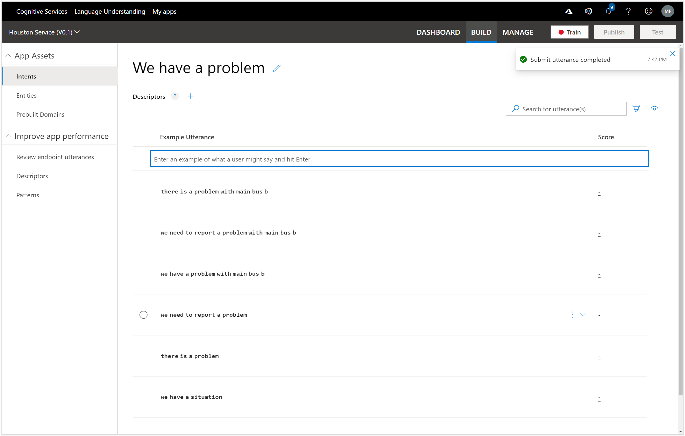

# Building an Utterance library
Now that we have the intent defined we can start building the library of different ways that we can ask the same question by defining Utterances within the Intents section of LUIS.
These will be the basis of our training model within LUIS that will help the system understand your questions.

All we need to do is start typing in the different Utterances that we may use to achieve the intent that we are defining.
For our first one we will type in a common way to ask about a product and enter Do we have any bricks?

When we press return, the sentence will be added to the list of Utterances.  We need at least five of these utterance examples in order to start training the LUIS model.

Let’s continue adding more utterances and add Are there any bricks in stock?.

We will add another common way of inquiring about products and add how many bricks do we have?

Next we will rephrase it and add another variation and also change the name of the product that we are looking for to give us some variation– Do we have any plates in inventory?

And we will add one last variation of the utterance and add do we have any tiles in stock?
That should give us enough to start training LUIS.

