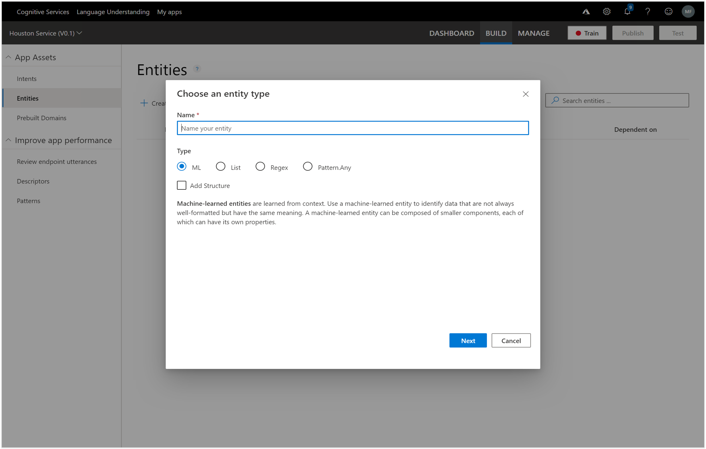
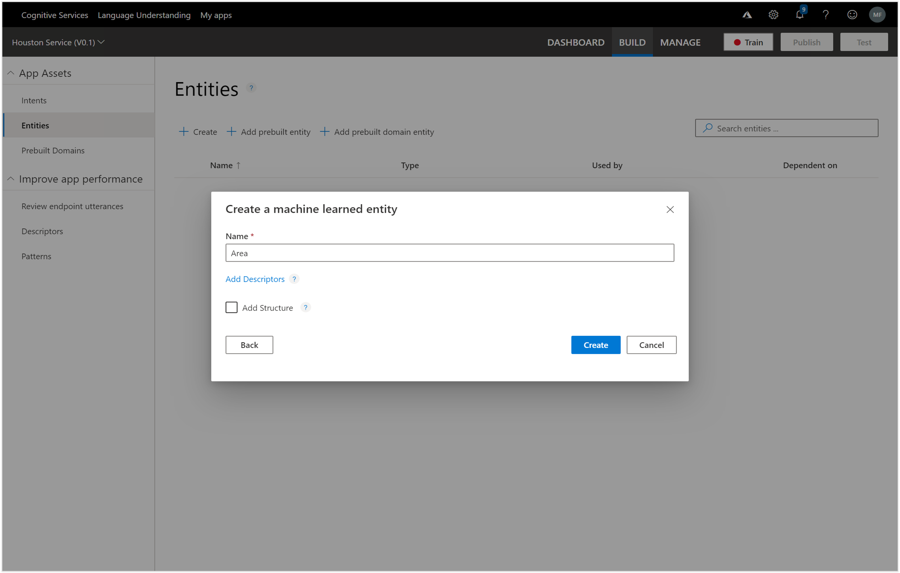
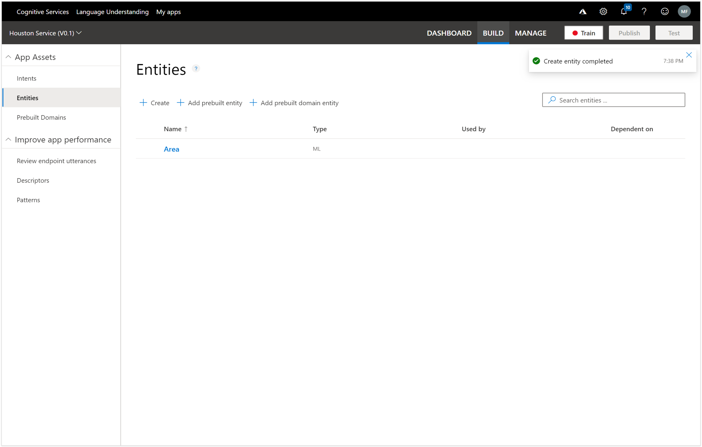

# Creating an Entity
There is another structure that we can use within LUIS called an Entity which is a way that we can mark items within a sentence that common in some way.  These entities are then passed through as additional information regarding the intent. 

To start off, we will switch to the Entities page within LUIS and then click on the + Create new entity link.

Now we have an entity that we can use to embellish our LUIS model with.

