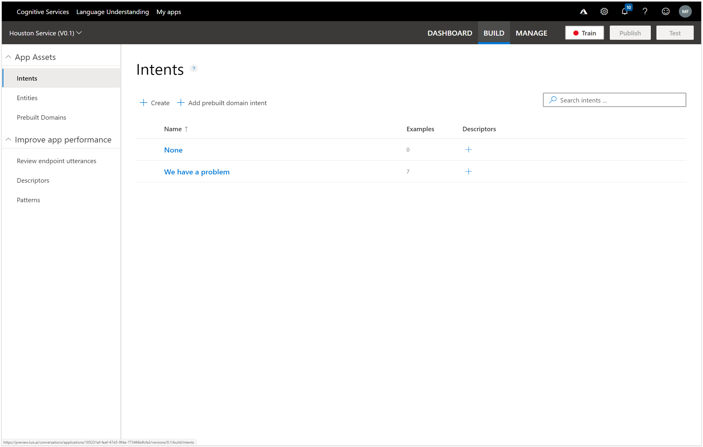
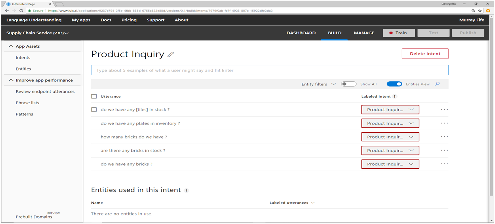
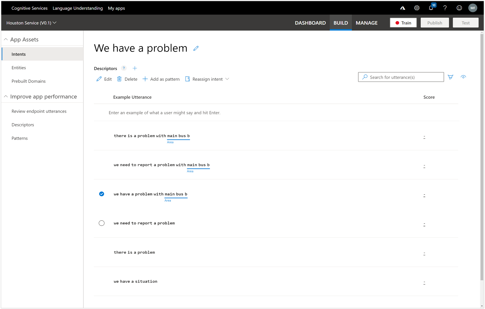

# Associating Entities with Utterances
Now that we have created our Entity we can start using it within the Intents to identify the parts of the utterances that hold the clues to what the user is asking for.

On the Intent page, if we hover over any of the words within the Utterances we will see that the word gets bracketed like this – see the [tiles] on the page.

If we right-mouse-click on the word then we get other options, including the option to mark the word as an entity – in this case we can select the Product Entity.

We can continue to mark all of the other words that relate to a product name within the other four utterances.

