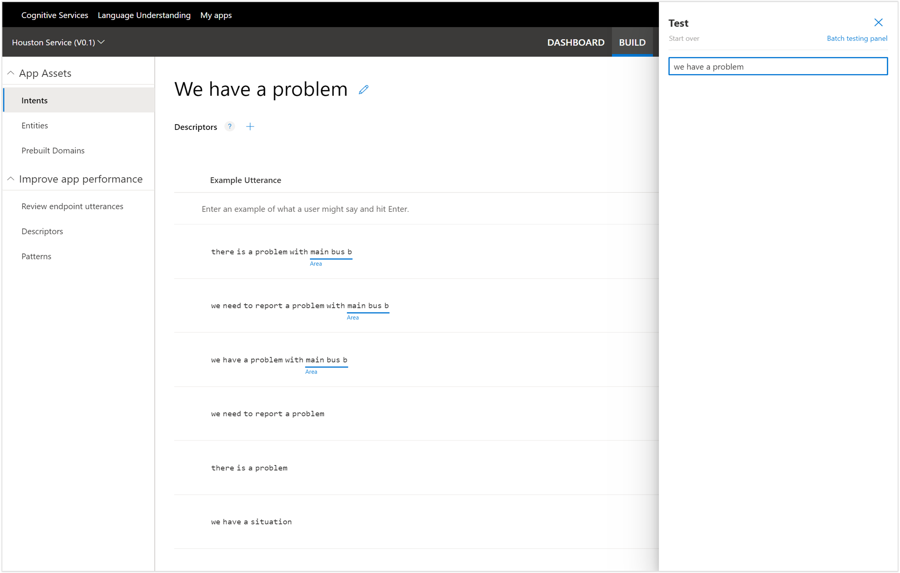
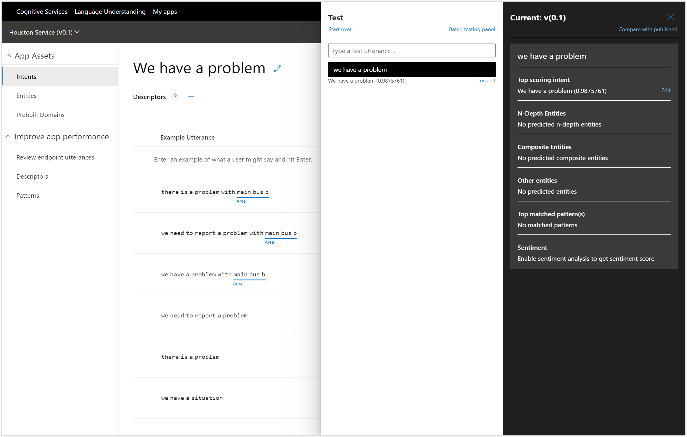

# Testing your LUIS Application
Before we publish this to production though we will take a little time to test the model and see if it understands what we are asking when we chat with it.

To test the model we just need to click on the Test button in the menu bar.

This will open up the Test panel where we can start chatting with LUIS.

All we need to do is type in the statement that we what LUIS to resolve.  In this case we just ask do we have any cogs in stock?

This will return back the result that this question is probably a Product Inquiry and LUIS is 96% certain of it.

If we click on the Inspect link below the result then we can see more detail about the sentence and we can see that it has also identified that the Product that I was interested in was cogs.

