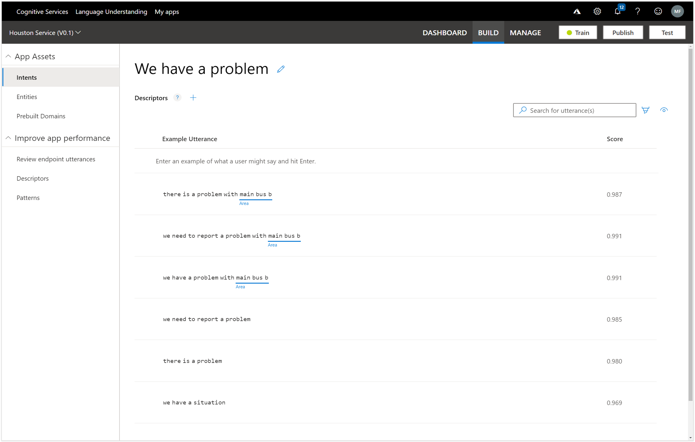
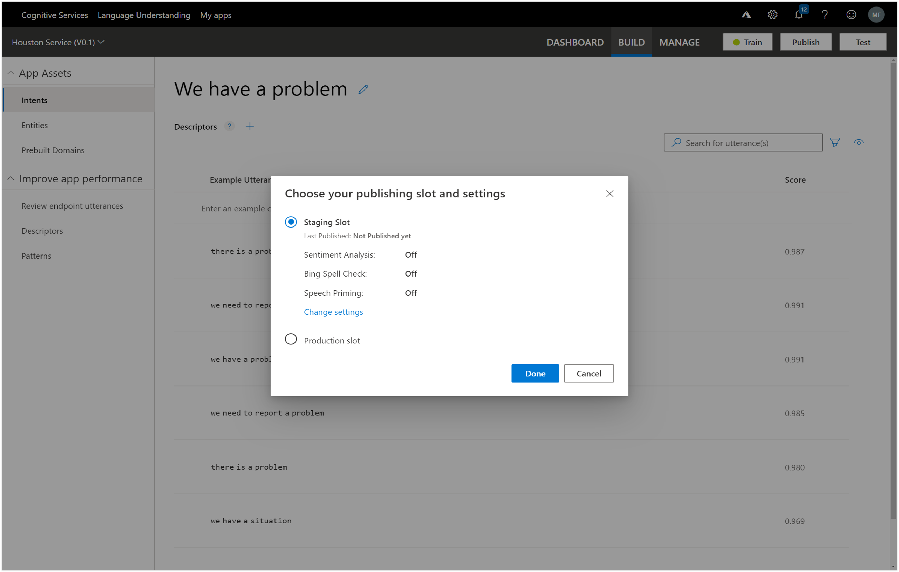
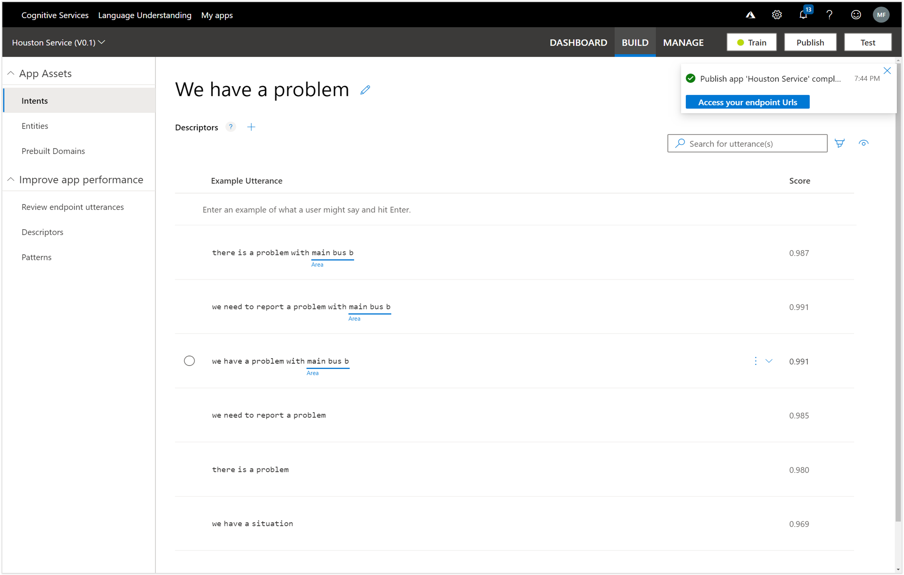
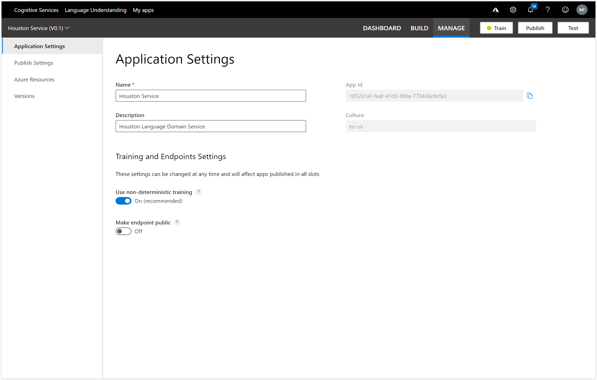
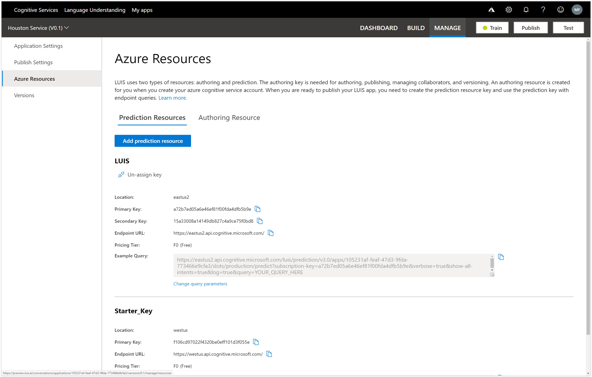

# Publishing your LUIS Application
The final step in the process is to publish the LUIS app so that we can use it within our Bot.

To do this, all we need to do is click on the Publish button.

This will open up a confirmation dialog box that will allow us to choose where we want to publish the app.  In this case we will leave the environment as the default Production value and then click on the Publish button.

If we click on the Keys and Endpoints option then we will also see some more information about the app including the end points, authoring key and also the password key that we will need later on to link our bot to the LUIS app.
So bookmark this page for one of the later steps.

