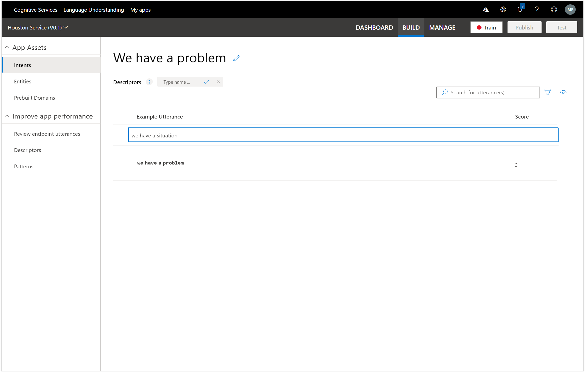

# Introduction
Creating Bots that integrate with Dynamics 365 has not been the easiest thing to do in the past for non-developers because it has required a lot of coding to be done, and also in order to change the conversation flows you needed to update and redeploy the code for the Bot to make it available to the users.
Recently I was introduced to a partner solution called AtBot that allows us to create Bot services through the AtBot portal that links to LUIS and Azure Bot  Services, allowing us to build conversation flows and dialogs using Flow as the authoring engine.
This allows us to build Bots with zero coding experience that also leverages the power of Flow to connect to other services seamlessly, allowing us to integrate Dynamics 365 using the standard entities.
In this walkthough we will show you how to configure and build an AtBot Bot that connects to Dynamics 365, using LUIS as the engine for discoving the users intent and deploy it out to chat platforms like Microsoft Teams.
This is gold I tell you, gold!

# Building a LUIS language model
We will start off by creating a LUIS language model that will be used by the Bot to infer what the intention of our questions are when we ask them.

# Logging into LUIS
We will start off by logging into the LUIS.

## How to do it…
To do this, all you need to do is navigate to the LUIS website by going to http://www.luis.ai and then click on the Login / Sign up link on the page.

This will allow you to authenticate with LUIS using your AD account.
And that will take you into the My Apps page within LUIS where you will be able to manage all of the different applications that you have trained within the Language Understanding system.

# Creating a LUIS Application
Now that we are logged into LUIS, we can create a Language Understanding App that we will be able to train on all of the different ways that we can ask questions to our bot.

## How to do it…
Start off by clicking on the + Create new app link within the My Apps page.

This will open up the Create new app form where we will be able to set up the details for our LUIS app.

Start off by giving the app a Name.  Here we set the Name to Supply Chain Service.

And if you want, you can give your app a more detailed Description.  Here we set the Description to Supply Chain Language Domain Service.
After you have done that just click on the Done button to create the new LUIS app.

This will take us into the Intents page which will allow us to create groupings of intents (or general objectives) that we will be able to classify out commands though.

# Creating a LUIS Intent
Now that we have the app we can start building the different types of questions or intents that LUIS will be able to use to classify statements with.

## How to do it…
All we need to do here is click on the + Create new intent link in the header of the Intents page.

This will open up a Create new intent dialog box.

We just need to give the Intent and Intent name and then click on the Done button.  For this example we set the Intent name to Product Inquiry because all of the sentences that we use to train LUIS will be related to inquiring about a product and also the availability of the product.

This will take us into the Intents page within LUIS that we will use to describe all of the different ways that we are able to ask the same question.

# Building an Utterance library
Now that we have the intent defined we can start building the library of different ways that we can ask the same question by defining Utterances within the Intents section of LUIS.
These will be the basis of our training model within LUIS that will help the system understand your questions.

<<<<<<< HEAD
## How to do it…
All we need to do is start typing in the different Utterances that we may use to achieve the intent that we are defining.
For our first one we will type in a common way to ask about a product and enter Do we have any bricks?
=======
All we need to do is start typing in the different Utterances that we may use to achieve the intent that we are defining.
For our first one we will type in a common way to ask about a product and enter Do we have any bricks?
>>>>>>> 9a816f1f074c1b353336b9a71f8b9fe1ee264b79

When we press return, the sentence will be added to the list of Utterances.  We need at least five of these utterance examples in order to start training the LUIS model.

Let’s continue adding more utterances and add Are there any bricks in stock?.

We will add another common way of inquiring about products and add how many bricks do we have?

Next we will rephrase it and add another variation and also change the name of the product that we are looking for to give us some variation– Do we have any plates in inventory?

And we will add one last variation of the utterance and add do we have any tiles in stock?
That should give us enough to start training LUIS.

# Creating an Entity
There is another structure that we can use within LUIS called an Entity which is a way that we can mark items within a sentence that common in some way.  These entities are then passed through as additional information regarding the intent. 

## How to do it…
To start off, we will switch to the Entities page within LUIS and then click on the + Create new entity link.

Now we have an entity that we can use to embellish our LUIS model with.

# Associating Entities with Utterances
Now that we have created our Entity we can start using it within the Intents to identify the parts of the utterances that hold the clues to what the user is asking for.

## How to do it…
On the Intent page, if we hover over any of the words within the Utterances we will see that the word gets bracketed like this – see the [tiles] on the page.

If we right-mouse-click on the word then we get other options, including the option to mark the word as an entity – in this case we can select the Product Entity.

We can continue to mark all of the other words that relate to a product name within the other four utterances.

# Training your LUIS Application
## How to do it…

This will queue the app for training.

And within a few seconds the training will be finished and we can start using it.

# Testing your LUIS Application
Before we publish this to production though we will take a little time to test the model and see if it understands what we are asking when we chat with it.

## How to do it…
To test the model we just need to click on the Test button in the menu bar.

This will open up the Test panel where we can start chatting with LUIS.

All we need to do is type in the statement that we what LUIS to resolve.  In this case we just ask do we have any cogs in stock?

This will return back the result that this question is probably a Product Inquiry and LUIS is 96% certain of it.

If we click on the Inspect link below the result then we can see more detail about the sentence and we can see that it has also identified that the Product that I was interested in was cogs.

# Publishing your LUIS Application
The final step in the process is to publish the LUIS app so that we can use it within our Bot.

## How to do it…
To do this, all we need to do is click on the Publish button.

This will open up a confirmation dialog box that will allow us to choose where we want to publish the app.  In this case we will leave the environment as the default Production value and then click on the Publish button.

If we click on the Keys and Endpoints option then we will also see some more information about the app including the end points, authoring key and also the password key that we will need later on to link our bot to the LUIS app.
So bookmark this page for one of the later steps.

# Review
How easy was that.  We have just created a LUIS model that will allow us to ask questions regarding the products in our inventory.  Using LUIS will make the conversation a lot easier with the bot because we don’t have to use exactly formatted phrases and it will extract the information that we need from the commands that we send it.

